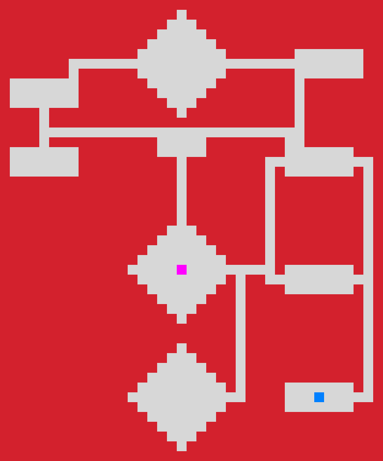
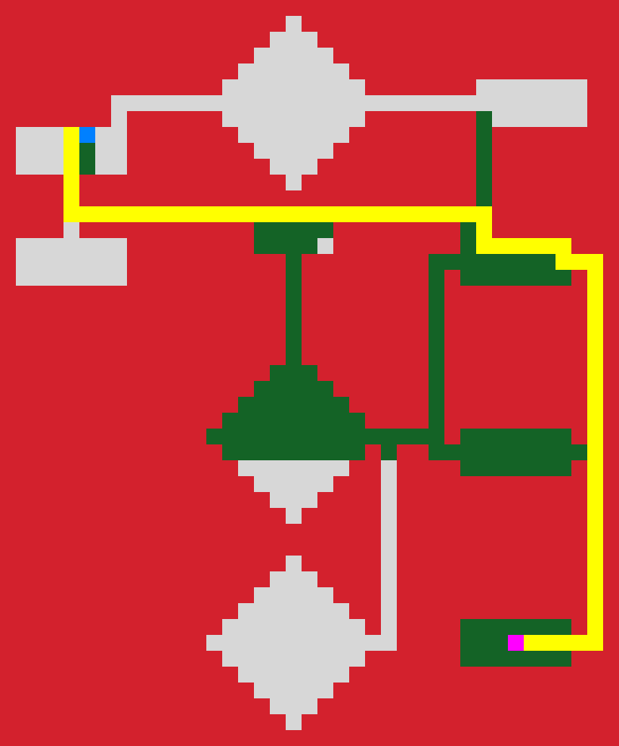

# tdt4136-a-star
Implementation of A* algorithm in the course TDT4136 Introduction to AI @ NTNU.

### Background
This project is based on an assignemnt from the course TDT4136 Introduction to AI. The
Map_Obj class is provided by the course and used as a background for the implementation
of A*. The csv-files used as maps are also provided by TDT4136. Code produced by my own
is found in astar.py, visualizer.py and main.py.

# Images
### Example 1
Initial map that is being traversed.

Map with start node (magenta) and goal node (cyan).

Closed nodes (green) after running A*.

Actual shortest path from start to goal.

### Example 2

